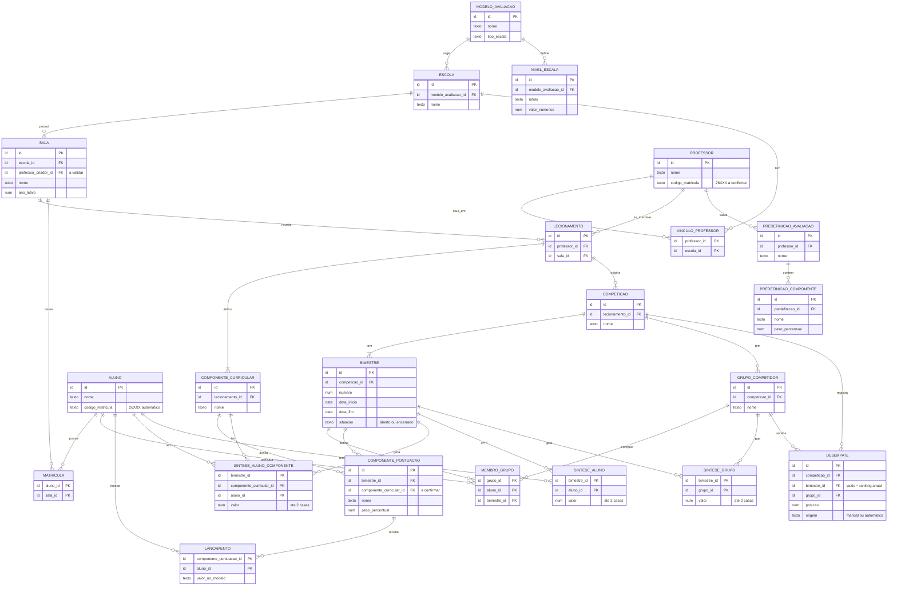

# Sistema de Competições Gamificadas — Entidades e Relacionamentos

**Versão:** 0.6 (rascunho vivo)
**Escopo:** modelo conceitual de dados. Sem tipos, tabelas ou stack: isso vem depois.

---

## 1. Premissas incorporadas

- Existem dois modelos de avaliação, numérico (1 a 10) e CPS ETEC (I, R, B, MB). Formam um **catálogo do sistema**, cadastrado pelo mantenedor.
- Cada **escola tem um único modelo**.
- O professor se **inscreve em uma sala** (lecionamento) e atribui a ela **todos os componentes curriculares** que leciona.
- Toda competição nasce de um **lecionamento** e engloba **todos os componentes curriculares** dele.
- Cada competição acontece entre grupos de **uma única sala** e tem **quatro bimestres**, com datas informadas pelo professor.
- Componentes de pontuação e pesos (percentuais somando 100%) são definidos **por bimestre**.
- Após o encerramento automático do bimestre, lançamentos, composição dos grupos e sínteses ficam **congelados**.
- Cada aluno pertence a **uma única sala por vez**.
- Pontuações e sínteses são numéricas, arredondadas a **duas casas decimais**.

## 2. Quem cadastra o quê

| Quem | Como | O que cadastra |
|---|---|---|
| Mantenedor | Direto no banco, sem GUI | Escola, modelo de avaliação (com níveis de escala), professor (docente) e vínculo professor–escola. |
| Professor | GUI | Sala, aluno, matrícula, lecionamento (inscrição na sala), componentes curriculares, competição, grupos, componentes de pontuação e pesos, lançamentos, desempate e predefinições. |
| Aluno | GUI | Nada. Visualiza e emite relatórios. |

## 3. Diagrama

## 4. Entidades principais

| Entidade | Papel |
|---|---|
| Escola | Instituição. Tem um único modelo de avaliação. |
| Sala | Turma de uma escola, em um ano letivo. Criada por um professor. |
| Professor | Docente cadastrado pelo mantenedor. Se inscreve em salas. |
| Aluno | Estudante cadastrado pelo professor. Pertence a uma única sala por vez. |
| GrupoCompetidor | Equipe de alunos que disputa uma competição. A sala é a do lecionamento da competição. |

## 5. Entidades de apoio

| Entidade | Por que existe |
|---|---|
| ModeloAvaliacao | Catálogo dos modelos do sistema (numérico 1 a 10 e CPS ETEC). |
| NivelEscala | Rótulos do modelo conceitual e seu valor numérico (I = 3, R = 5, B = 8, MB = 10). |
| Lecionamento | Inscrição de um professor em uma sala. É a origem da competição. |
| ComponenteCurricular | Matéria que o professor leciona na sala (por exemplo, Interfaces). |
| Competicao | Nasce de um lecionamento. Engloba todos os componentes curriculares dele. |
| Bimestre | Um dos quatro períodos da competição, com datas. Encerra automaticamente e congela. |
| ComponentePontuacao | Atividade avaliada com peso percentual, em um bimestre. |
| Lancamento | Pontuação de um aluno em um componente de pontuação. Ausente vale 0. |
| MembroGrupo | Aluno x Grupo, por bimestre (permite a troca de equipe). |
| SinteseAlunoComponente | Síntese do aluno em uma matéria, em um bimestre. Gravada ao encerrar. |
| SinteseAluno | Síntese bimestral geral do aluno (média entre as matérias). Gravada ao encerrar. |
| SinteseGrupo | Síntese bimestral do grupo (média dos integrantes). Gravada ao encerrar. |
| Desempate | Posição definida pelo professor (manual) ou pelo critério automático. Sem bimestre, vale para o ranking anual. |
| PredefinicaoAvaliacao e PredefinicaoComponente | Componentes e pesos salvos nas preferências do professor. |
| VinculoProfessor | Professor x Escola. |
| Matricula | Aluno x Sala. |

## 6. Relacionamentos

| Relação | Cardinalidade | Justificativa |
|---|---|---|
| ModeloAvaliacao → Escola | 1:N | Cada escola tem um único modelo; o mesmo modelo serve a várias escolas. |
| ModeloAvaliacao → NivelEscala | 1:N | Modelos conceituais têm rótulos com valor numérico. |
| Escola → Sala | 1:N | Toda sala pertence a uma escola. |
| Escola ↔ Professor | N:M (VinculoProfessor) | Um professor pode atuar em mais de uma escola. |
| Professor ↔ Sala | N:M (Lecionamento) | Vários professores podem se inscrever na mesma sala; um professor pode se inscrever em várias salas. |
| Lecionamento → ComponenteCurricular | 1:N (mínimo 1) | O professor atribui à sala todos os componentes que leciona. |
| Aluno ↔ Sala | N:M (Matricula), 1 ativa por vez | O aluno pertence a uma única sala por vez. |
| Lecionamento → Competicao | 1:N | Cada competição nasce de um lecionamento. |
| Competicao → Bimestre | 1:4 | Toda competição tem quatro bimestres. |
| Competicao → GrupoCompetidor | 1:N | Os grupos são criados a cada competição. |
| Aluno ↔ Grupo | N:M (MembroGrupo, por bimestre) | Composição das equipes em cada bimestre. |
| Bimestre → ComponentePontuacao | 1:N | Componentes e pesos são definidos por bimestre. |
| ComponenteCurricular → ComponentePontuacao | 1:N | Hipótese: os componentes de pontuação são definidos por matéria. |
| ComponentePontuacao ↔ Aluno | N:M (Lancamento) | Cada aluno recebe uma pontuação por componente. |
| Bimestre → Sínteses | 1:N | Sínteses gravadas ao encerrar o bimestre. |
| Competicao → Desempate | 1:N | Ordem entre grupos empatados. |
| Professor → PredefinicaoAvaliacao | 1:N | Predefinições nas preferências do professor. |

## 7. Regras de integridade

1. Toda competição nasce de **um lecionamento** e engloba todos os componentes curriculares dele.
2. O professor só se inscreve em salas de **escolas às quais está vinculado**.
3. Os grupos pertencem à competição e, portanto, à **mesma sala**.
4. O aluno só entra em grupo se estiver **matriculado na sala** da competição.
5. O aluno tem **uma única matrícula ativa** por vez.
6. Em cada bimestre, o aluno pertence a **no máximo um grupo** da competição. Vale a composição no encerramento do bimestre.
7. O lançamento segue o **modelo da escola** da sala. Componente sem lançamento vale **0**.
8. Em cada bimestre, os pesos dos componentes de pontuação **somam 100%**.
9. Com o bimestre encerrado, **lançamentos, pesos, composição e sínteses não podem ser alterados**.
10. Pontuações e sínteses têm **no máximo duas casas decimais**, arredondadas.
11. Escolas, modelos de avaliação, docentes e vínculos professor–escola são criados **apenas pelo mantenedor**, direto no banco.
12. O **código de matrícula** é gerado automaticamente no cadastro, no padrão 26XXX.
13. Toda escola tem **exatamente um** modelo de avaliação.

## 8. Comportamentos automáticos

- **Encerramento:** ao chegar a data final do bimestre, o sistema o encerra e grava as sínteses.
- **Alerta de empate:** ao detectar empate nas sínteses, o sistema alerta o professor imediatamente. O professor tem até a data limite do fechamento do bimestre para desempatar.
- **Desempate automático:** sem desempate manual, vence o grupo com melhor média dos integrantes nos componentes de maior peso. Vale também para o ranking anual.
- **Código de matrícula:** gerado automaticamente no cadastro, inclusive nos cadastros feitos direto no banco.

## 9. Dados derivados (calculados)

Não são entidades. As fórmulas estão em `03-regras-de-calculo.md`.

- Pontuação final do aluno (média das quatro sínteses).
- Pontuação final do grupo (soma das quatro sínteses bimestrais do grupo).
- Posição nos rankings (parcial, anual e individual), antes do desempate.

## 10. Pendências de modelagem

1. **Cálculo com várias matérias:** confirmar a interpretação e se as matérias podem mudar durante o ano.
2. **Pesos por matéria:** confirmar.
3. **Competições por lecionamento:** mais de uma por ano?
4. **Ranking individual:** escopo, visibilidade e desempate.
5. **Desempate automático** com várias matérias.
6. **Código de matrícula:** formato, uso por professores, senha e primeiro acesso.
7. **Sala compartilhada:** aprovação de inscrição e quem edita sala e alunos.
