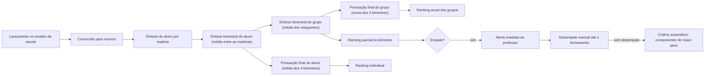

# Sistema de Competições Gamificadas — Regras de Cálculo

**Versão:** 0.5 (rascunho vivo)
**Escopo:** como as pontuações são calculadas, do lançamento aos rankings.

---

## 1. Fluxo geral



## 2. Modelos de avaliação

| Modelo | Valores lançados | Conversão para número |
|---|---|---|
| Numérico | Nota de 1 a 10 | Valor direto |
| CPS ETEC | I, R, B, MB | I = 3, R = 5, B = 8, MB = 10 |

A síntese é sempre numérica. O lançamento fica no modelo da escola. Componente sem lançamento vale **0**.

## 3. Casas decimais

Pontuações e sínteses são numéricas e guardadas com até **duas casas decimais**, **arredondadas**. Os empates são avaliados sobre o valor já guardado.

## 4. Fórmulas

Os pesos são percentuais e somam 100%. Legenda: **b** = bimestre, **c** = componente curricular (matéria), **C** = número de matérias atribuídas.

**Síntese do aluno por matéria** (média ponderada dos componentes de pontuação):

```
S(b,c) = Σ (nota_i × peso_i / 100)
```

**Síntese bimestral do aluno** (média simples entre as matérias):

```
S(b) = (S(b,1) + S(b,2) + ... + S(b,C)) / C
```

**Síntese bimestral do grupo** (média das sínteses dos integrantes):

```
G(b) = (S(b)_aluno1 + S(b)_aluno2 + ... + S(b)_alunoN) / N
```

**Pontuação final do aluno** (média simples das quatro sínteses):

```
M = (S(1) + S(2) + S(3) + S(4)) / 4
```

**Pontuação final do grupo** (soma das quatro sínteses bimestrais do grupo, sem média):

```
P = G(1) + G(2) + G(3) + G(4)
```

**Rankings**

- Ranking parcial: pela síntese do grupo no bimestre.
- Ranking anual dos grupos: pela pontuação final do grupo.
- Ranking individual: pela pontuação final do aluno.

### Interpretação a confirmar

Foi definido que o ranking final é uma média das sínteses de todas as matérias atribuídas. A fórmula acima é equivalente a calcular, para cada matéria, a soma anual do grupo e depois tirar a média entre as matérias. Os dois caminhos dão o mesmo resultado **se as matérias forem as mesmas nos quatro bimestres**. Por isso, a hipótese é que as matérias não mudam durante a competição.

## 5. Composição do grupo e troca de equipe

Vale a **composição do grupo no encerramento do bimestre**.

- **Troca no meio do bimestre**, antes da síntese do grupo: toda a pontuação do aluno no bimestre atual conta para o novo grupo.
- **Troca entre bimestres**: as sínteses de bimestres encerrados não mudam. A nova composição vale a partir da próxima síntese.
- **Aluno que entra no meio do ano**: o professor o coloca em um grupo; os bimestres já encerrados não mudam.

## 6. Bimestres

- O professor informa **início e fim** de cada bimestre ao criar a competição.
- O encerramento é **automático na data final**.
- Lançamentos, pesos, composição e sínteses só podem ser alterados **enquanto o bimestre está aberto**. Depois do encerramento, ficam congelados.

## 7. Desempate

1. Ao final das sínteses, se houver empate, o sistema emite **alerta imediato** ao professor.
2. O professor pode desempatar manualmente **até a data limite do fechamento do bimestre**.
3. Sem desempate manual, vence o grupo com melhor pontuação nos componentes de maior peso: compara-se a **média dos integrantes** em cada componente, **do maior peso para o menor**.
4. A mesma regra vale para o **ranking anual**, com prazo no fechamento do último bimestre.

A definição de "componentes de maior peso" com várias matérias está **a confirmar**. O desempate no ranking individual também.

## 8. Comparações nos relatórios

- Comparações anuais são feitas **bimestre a bimestre**, na mesma escala (0 a 10).
- A pontuação final do grupo (soma, até 40) aparece **à parte**.

## 9. Exemplos ilustrativos

Valores inventados, só para ilustrar.

**Aluno com duas matérias (modelo numérico).** Pesos em cada matéria: Prova 50%, Caderno 20%, Projeto 30%.

```
Matéria 1, notas 8, 10 e 6:  S = 8×0,5 + 10×0,2 + 6×0,3 = 7,8
Matéria 2, notas 9, 10 e 7:  S = 9×0,5 + 10×0,2 + 7×0,3 = 8,6
Síntese bimestral: S(b) = (7,8 + 8,6) / 2 = 8,2
```

**Modelo CPS ETEC.** Mesmos pesos. Conceitos: B, MB e R, ou seja, 8, 10 e 5.

```
S = 8×0,5 + 10×0,2 + 5×0,3 = 4 + 2 + 1,5 = 7,5
```

**Grupo com três integrantes.** Sínteses bimestrais: 8,2, 7,5 e 9,1.

```
G = (8,2 + 7,5 + 9,1) / 3 = 8,2666... → 8,27
```

**Pontuação final do grupo.** Sínteses do grupo: 8,27, 7,60, 8,40 e 7,90.

```
P = 8,27 + 7,60 + 8,40 + 7,90 = 32,17
```

## 10. Pendências

- Confirmar a interpretação com várias matérias e se as matérias podem mudar durante o ano.
- Confirmar se os pesos são definidos por matéria.
- Cálculos encadeados usam o valor já arredondado ou o valor bruto?
- Detalhes do desempate automático com várias matérias e do desempate no ranking individual.
