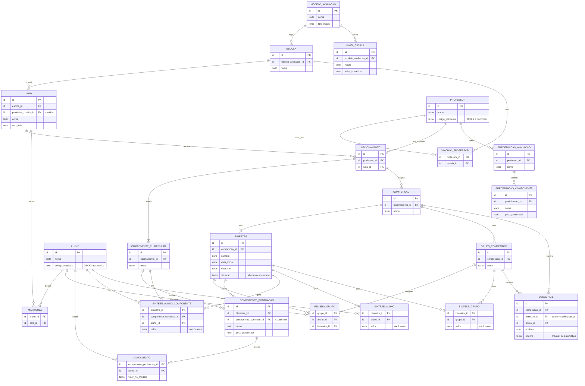
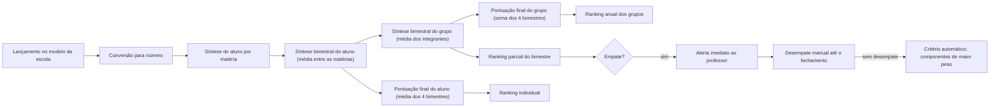

# Visão e Funcionalidades

**Versão:** 0.8 (rascunho vivo)
**Escopo desta fase:** arquitetura, funcionalidades e comportamentos.
**Fora de escopo por ora:** escolha de stack técnico.

---

## 1. Contexto

O sistema nasce junto com a tese de mestrado de um professor. A pesquisa exige métodos de **motivação estudantil** e **acolhimento dos jovens**, fazendo-os sentir que vale a pena estudar. Para isso, o professor usa uma **metodologia de gamificação** baseada em competições entre equipes de alunos.

## 2. Problema

- Hoje, dados, grupos e atividades são registrados em **Google Sheets e Excel**.
- Esse registro dá trabalho ao professor.
- Outros professores, que poderiam aplicar a metodologia, não a aplicam por falta de conhecimento técnico das ferramentas.

## 3. Objetivo

Oferecer um sistema, análogo a um sistema acadêmico, em que:

- o **professor** cria e monitora as competições por meio de interfaces intuitivas;
- os **alunos** visualizam os resultados.

Critério de sucesso: um professor sem conhecimento técnico consegue aplicar a metodologia sem depender de planilhas.

## 4. Atores

| Ator | O que faz | Interface | Status |
|---|---|---|---|
| Mantenedor (admin) | Cadastra as entidades primordiais, que ditam a organização do sistema: escolas, modelos de avaliação, docentes e o vínculo professor–escola | **Direto no banco de dados, sem interface gráfica** | Confirmado |
| Professor | Cria salas e alunos, se inscreve em salas, atribui componentes curriculares, cria competições e grupos, define componentes de pontuação e pesos, lança pontuações, resolve empates e emite relatórios | GUI | Confirmado |
| Aluno | Visualiza rankings e emite os próprios relatórios | GUI | Confirmado |
| Outros (coordenação, responsáveis...) | — | — | A validar |

## 5. Regras de negócio confirmadas

### 5.1 Salas, professores e alunos

| # | Regra |
|---|---|
| RN1 | O vínculo professor–escola é feito pelo **mantenedor**. |
| RN2 | O vínculo professor–sala é feito **pelos próprios professores**. Ao cadastrar uma sala e seus alunos, outros professores podem **se inscrever** para ministrar competições nela. Não há limite de salas por professor, por ora. |
| RN3 | O professor cadastra os **componentes curriculares** ao criar a sala e atribui à sala **todos os que leciona** para ela. Pode lecionar componentes diferentes para salas diferentes. Exemplo: Interfaces para o 2º DS; Gestão Empresarial para o 3º ADM. |
| RN4 | Cada aluno pertence a **uma única sala por vez**. |
| RN5 | Salas e alunos são cadastrados **pelo professor**. |

### 5.2 Competição

| # | Regra |
|---|---|
| RN6 | Cada competição acontece entre grupos de **uma única sala**. |
| RN7 | A competição engloba o desempenho dos integrantes em **todos os componentes curriculares** que o professor cadastrou para a sala. |
| RN8 | Os grupos são criados a cada nova competição. |
| RN9 | O aluno pode trocar de equipe. Vale a composição do grupo **no encerramento do bimestre**. Aluno que entra no meio do ano é colocado em um grupo pelo professor; bimestres já encerrados não mudam. |
| RN10 | A cada bimestre, o professor define os **componentes de pontuação** (caderno, projetos, provas, trabalhos etc.). Os pesos são **percentuais que somam 100%**. |
| RN11 | As **predefinições de avaliação** (componentes e pesos) pertencem às preferências do professor e podem ser reutilizadas. |
| RN12 | Não há elementos de gamificação além de **pontos e rankings**. |

### 5.3 Pontuação

| # | Regra |
|---|---|
| RN13 | A **síntese bimestral do aluno** é a média ponderada dos componentes. Com vários componentes curriculares, o **ranking final é uma média das sínteses de todas as matérias atribuídas**. *(detalhes na pergunta 1)* |
| RN14 | A **síntese bimestral do grupo** é a média das sínteses dos integrantes. |
| RN15 | A pontuação final do **aluno** é a **média simples** das quatro sínteses. A pontuação final do **grupo** é a **soma** das quatro sínteses bimestrais do grupo, **sem média**. |
| RN16 | Rankings: **anual dos grupos** (pontuação final do grupo), **parcial de cada bimestre** e **individual** dos alunos. |
| RN17 | Existem **dois modelos de avaliação**: numérico (1 a 10) e CPS ETEC (I = 3, R = 5, B = 8, MB = 10). Cada escola tem **um único modelo**. |
| RN18 | Os componentes seguem o modelo da escola. A síntese é **sempre numérica**. |
| RN19 | Componente sem lançamento vale **0**. |
| RN20 | Pontuações e sínteses são numéricas, com até **duas casas decimais**, **arredondadas**. |

### 5.4 Bimestres e desempate

| # | Regra |
|---|---|
| RN21 | O professor informa **início e fim de cada bimestre** ao criar a competição. O encerramento é **automático na data final**. |
| RN22 | Lançamentos, pesos, composição dos grupos e sínteses só podem ser alterados **durante o respectivo bimestre**. Depois disso ficam congelados. |
| RN23 | Em caso de **empate ao final das sínteses**, o sistema emite **alerta imediato** ao professor, que deve desempatar **até a data limite do fechamento do bimestre**. |
| RN24 | Sem desempate manual, vence o grupo com melhor pontuação nos componentes de maior peso: compara-se a **média dos integrantes** em cada componente, **do maior peso para o menor**. |
| RN25 | A mesma regra vale para o **ranking anual**, com prazo no fechamento do último bimestre. |

### 5.5 Acesso

| # | Regra |
|---|---|
| RN26 | O login é feito pelo **código de matrícula**, gerado automaticamente no cadastro no padrão **26XXX** (X = auto increment). |
| RN27 | Um professor pode atuar em **mais de uma escola**. |

### 5.6 Relatórios e visibilidade

| # | Regra |
|---|---|
| RN28 | Existem quatro relatórios: **individual**, **individual comparado aos demais integrantes do grupo**, **coletivo** e **coletivo comparado aos demais grupos**. |
| RN29 | O **aluno** emite apenas o **seu** relatório individual e os do **seu grupo**. |
| RN30 | O **professor** emite o individual de **qualquer aluno** e os relatórios de **qualquer grupo**. |
| RN31 | Todos os dados são visíveis, **sem anonimato**. |
| RN32 | Relatórios são exportados em **PDF**, a qualquer estágio da competição, com gráficos e todos os dados. |
| RN33 | Nas comparações anuais, compara-se **bimestre a bimestre** (mesma escala) e a pontuação final do grupo aparece **à parte**. |

## 6. Funcionalidades da GUI (visão inicial)

O cadastro do mantenedor não entra aqui: é feito direto no banco.

| # | Funcionalidade | Ator | Status |
|---|---|---|---|
| F1 | Entrar com o código de matrícula | Professor e aluno | A detalhar |
| F2 | Criar sala, cadastrar alunos (código gerado automaticamente) e atribuir componentes curriculares | Professor | A detalhar |
| F3 | Inscrever-se em sala existente e atribuir os componentes que leciona | Professor | A detalhar |
| F4 | Criar competição (sala e datas dos quatro bimestres) | Professor | A detalhar |
| F5 | Criar grupos, atribuir alunos e trocar aluno de equipe | Professor | A detalhar |
| F6 | Definir componentes de pontuação e pesos (somando 100%) a cada bimestre | Professor | A detalhar |
| F7 | Salvar e reutilizar predefinições de avaliação | Professor | A detalhar |
| F8 | Lançar pontuação dos alunos por componente, conforme o modelo da escola | Professor | A detalhar |
| F9 | Calcular sínteses, pontuações finais e rankings (parcial, anual e individual) | Sistema | A detalhar |
| F10 | Encerrar o bimestre na data final e congelar as sínteses | Sistema | A detalhar |
| F11 | Alertar empate, permitir desempate manual e aplicar o critério automático | Sistema e professor | A detalhar |
| F12 | Emitir os relatórios em PDF, conforme o perfil | Professor e aluno | A detalhar |
| F13 | Ver os rankings | Professor e aluno | A detalhar |

## 7. Glossário

| Termo | Definição |
|---|---|
| Mantenedor | Responsável pelo sistema. Cadastra as entidades primordiais direto no banco. |
| Escola | Instituição cadastrada, com professores vinculados e um modelo de avaliação. |
| Sala | Turma de uma escola (por exemplo, 2º DS). Criada por um professor. |
| Componente curricular (matéria) | Disciplina que o professor leciona para uma sala (por exemplo, Interfaces). |
| Lecionamento (inscrição) | Vínculo entre um professor e uma sala, com os componentes curriculares que ele leciona nela. Origem da competição. |
| Competição | Disputa entre grupos de uma única sala, ligada a um lecionamento. Engloba todos os componentes curriculares do professor na sala. |
| Grupo (equipe) | Conjunto de alunos da sala que disputa uma competição. |
| Componente de pontuação | Atividade avaliada (caderno, projeto, prova, trabalho...) com peso percentual em um bimestre. |
| Modelo de avaliação | Escala usada pela escola: numérica (1 a 10) ou CPS ETEC (I, R, B, MB). |
| Predefinição de avaliação | Conjunto salvo de componentes e pesos, reutilizável em outras competições. |
| Síntese bimestral | Pontuação do aluno ou do grupo em um bimestre. |
| Código de matrícula | Identificador de login, no padrão 26XXX, gerado automaticamente no cadastro. |

## 8. Perguntas em aberto

Em ordem de prioridade.

1. Com várias matérias, o cálculo entendido é: síntese por matéria, média simples entre as matérias, e a pontuação final do grupo é a soma dos quatro bimestres. Está certo? As matérias podem mudar durante o ano?
2. Os pesos dos componentes de pontuação são definidos por matéria (somando 100% em cada matéria, a cada bimestre)?
3. Um mesmo professor pode ter mais de uma competição na mesma sala no ano?
4. Ranking individual: entre todos os alunos da sala, visível a todos, com a mesma regra de desempate?
5. No desempate automático, "componentes de maior peso" são considerados juntando todas as matérias?
6. Código de matrícula: "26" é o ano do cadastro? Quantos dígitos tem o contador (três dígitos limitam a 999 por ano)? Vale também para professores? Como funcionam a senha e o primeiro acesso?
7. Sala compartilhada: qualquer professor da escola pode se inscrever sem aprovação? Quem pode editar a sala e os alunos?

## 9. Notas para a fase técnica

- O cadastro do mantenedor é feito direto no banco: o modelo deve ser fácil de povoar sem tela, e o código de matrícula precisa ser gerado automaticamente também nesse caminho.
- Senhas iniciais dos docentes cadastrados direto no banco precisam ser tratadas com segurança.

## 10. Observações

- A comparação exibe nomes e notas dos colegas de grupo, e os usuários são menores de idade. Vale alinhar com a escola e com o orientador do mestrado (LGPD e, se aplicável, comitê de ética da pesquisa).

## 11. Histórico de versões

| Versão | Mudança |
|---|---|
| 0.1 | Contexto, problema, objetivo e atores iniciais. |
| 0.2 | Regras de negócio e glossário iniciais. |
| 0.3 | Modelos de avaliação vinculados às escolas. |
| 0.4 | Regras de cálculo, atores, acesso e funcionalidades detalhadas. |
| 0.5 | Pontuação do grupo, conversão ETEC, pesos percentuais, troca de equipe, bimestres congelados, ranking parcial, PDF. |
| 0.6 | Pontuação final do grupo passa a ser a soma das sínteses bimestrais, sem média. |
| 0.7 | Componente curricular e lecionamento, cadastros pelo professor, bimestres com datas, regra de desempate, duas casas decimais, quatro relatórios, nome de usuário. |
| 0.8 | Competição engloba todas as matérias do professor na sala, inscrição de professores em salas, mantenedor sem GUI, ranking individual, escopo dos relatórios, login por código de matrícula. |

# Entidades e Relacionamentos

**Versão:** 0.6 (rascunho vivo)
**Escopo:** modelo conceitual de dados. Sem tipos, tabelas ou stack: isso vem depois.

---

## 1. Premissas incorporadas

- Existem dois modelos de avaliação, numérico (1 a 10) e CPS ETEC (I, R, B, MB). Formam um **catálogo do sistema**, cadastrado pelo mantenedor.
- Cada **escola tem um único modelo**.
- O professor se **inscreve em uma sala** (lecionamento) e atribui a ela **todos os componentes curriculares** que leciona.
- Toda competição nasce de um **lecionamento** e engloba **todos os componentes curriculares** dele.
- Cada competição acontece entre grupos de **uma única sala** e tem **quatro bimestres**, com datas informadas pelo professor.
- Componentes de pontuação e pesos (percentuais somando 100%) são definidos **por bimestre**.
- Após o encerramento automático do bimestre, lançamentos, composição dos grupos e sínteses ficam **congelados**.
- Cada aluno pertence a **uma única sala por vez**.
- Pontuações e sínteses são numéricas, arredondadas a **duas casas decimais**.

## 2. Quem cadastra o quê

| Quem | Como | O que cadastra |
|---|---|---|
| Mantenedor | Direto no banco, sem GUI | Escola, modelo de avaliação (com níveis de escala), professor (docente) e vínculo professor–escola. |
| Professor | GUI | Sala, aluno, matrícula, lecionamento (inscrição na sala), componentes curriculares, competição, grupos, componentes de pontuação e pesos, lançamentos, desempate e predefinições. |
| Aluno | GUI | Nada. Visualiza e emite relatórios. |

## 3. Diagrama



## 4. Entidades principais

| Entidade | Papel |
|---|---|
| Escola | Instituição. Tem um único modelo de avaliação. |
| Sala | Turma de uma escola, em um ano letivo. Criada por um professor. |
| Professor | Docente cadastrado pelo mantenedor. Se inscreve em salas. |
| Aluno | Estudante cadastrado pelo professor. Pertence a uma única sala por vez. |
| GrupoCompetidor | Equipe de alunos que disputa uma competição. A sala é a do lecionamento da competição. |

## 5. Entidades de apoio

| Entidade | Por que existe |
|---|---|
| ModeloAvaliacao | Catálogo dos modelos do sistema (numérico 1 a 10 e CPS ETEC). |
| NivelEscala | Rótulos do modelo conceitual e seu valor numérico (I = 3, R = 5, B = 8, MB = 10). |
| Lecionamento | Inscrição de um professor em uma sala. É a origem da competição. |
| ComponenteCurricular | Matéria que o professor leciona na sala (por exemplo, Interfaces). |
| Competicao | Nasce de um lecionamento. Engloba todos os componentes curriculares dele. |
| Bimestre | Um dos quatro períodos da competição, com datas. Encerra automaticamente e congela. |
| ComponentePontuacao | Atividade avaliada com peso percentual, em um bimestre. |
| Lancamento | Pontuação de um aluno em um componente de pontuação. Ausente vale 0. |
| MembroGrupo | Aluno x Grupo, por bimestre (permite a troca de equipe). |
| SinteseAlunoComponente | Síntese do aluno em uma matéria, em um bimestre. Gravada ao encerrar. |
| SinteseAluno | Síntese bimestral geral do aluno (média entre as matérias). Gravada ao encerrar. |
| SinteseGrupo | Síntese bimestral do grupo (média dos integrantes). Gravada ao encerrar. |
| Desempate | Posição definida pelo professor (manual) ou pelo critério automático. Sem bimestre, vale para o ranking anual. |
| PredefinicaoAvaliacao e PredefinicaoComponente | Componentes e pesos salvos nas preferências do professor. |
| VinculoProfessor | Professor x Escola. |
| Matricula | Aluno x Sala. |

## 6. Relacionamentos

| Relação | Cardinalidade | Justificativa |
|---|---|---|
| ModeloAvaliacao → Escola | 1:N | Cada escola tem um único modelo; o mesmo modelo serve a várias escolas. |
| ModeloAvaliacao → NivelEscala | 1:N | Modelos conceituais têm rótulos com valor numérico. |
| Escola → Sala | 1:N | Toda sala pertence a uma escola. |
| Escola ↔ Professor | N:M (VinculoProfessor) | Um professor pode atuar em mais de uma escola. |
| Professor ↔ Sala | N:M (Lecionamento) | Vários professores podem se inscrever na mesma sala; um professor pode se inscrever em várias salas. |
| Lecionamento → ComponenteCurricular | 1:N (mínimo 1) | O professor atribui à sala todos os componentes que leciona. |
| Aluno ↔ Sala | N:M (Matricula), 1 ativa por vez | O aluno pertence a uma única sala por vez. |
| Lecionamento → Competicao | 1:N | Cada competição nasce de um lecionamento. |
| Competicao → Bimestre | 1:4 | Toda competição tem quatro bimestres. |
| Competicao → GrupoCompetidor | 1:N | Os grupos são criados a cada competição. |
| Aluno ↔ Grupo | N:M (MembroGrupo, por bimestre) | Composição das equipes em cada bimestre. |
| Bimestre → ComponentePontuacao | 1:N | Componentes e pesos são definidos por bimestre. |
| ComponenteCurricular → ComponentePontuacao | 1:N | Hipótese: os componentes de pontuação são definidos por matéria. |
| ComponentePontuacao ↔ Aluno | N:M (Lancamento) | Cada aluno recebe uma pontuação por componente. |
| Bimestre → Sínteses | 1:N | Sínteses gravadas ao encerrar o bimestre. |
| Competicao → Desempate | 1:N | Ordem entre grupos empatados. |
| Professor → PredefinicaoAvaliacao | 1:N | Predefinições nas preferências do professor. |

## 7. Regras de integridade

1. Toda competição nasce de **um lecionamento** e engloba todos os componentes curriculares dele.
2. O professor só se inscreve em salas de **escolas às quais está vinculado**.
3. Os grupos pertencem à competição e, portanto, à **mesma sala**.
4. O aluno só entra em grupo se estiver **matriculado na sala** da competição.
5. O aluno tem **uma única matrícula ativa** por vez.
6. Em cada bimestre, o aluno pertence a **no máximo um grupo** da competição. Vale a composição no encerramento do bimestre.
7. O lançamento segue o **modelo da escola** da sala. Componente sem lançamento vale **0**.
8. Em cada bimestre, os pesos dos componentes de pontuação **somam 100%**.
9. Com o bimestre encerrado, **lançamentos, pesos, composição e sínteses não podem ser alterados**.
10. Pontuações e sínteses têm **no máximo duas casas decimais**, arredondadas.
11. Escolas, modelos de avaliação, docentes e vínculos professor–escola são criados **apenas pelo mantenedor**, direto no banco.
12. O **código de matrícula** é gerado automaticamente no cadastro, no padrão 26XXX.
13. Toda escola tem **exatamente um** modelo de avaliação.

## 8. Comportamentos automáticos

- **Encerramento:** ao chegar a data final do bimestre, o sistema o encerra e grava as sínteses.
- **Alerta de empate:** ao detectar empate nas sínteses, o sistema alerta o professor imediatamente. O professor tem até a data limite do fechamento do bimestre para desempatar.
- **Desempate automático:** sem desempate manual, vence o grupo com melhor média dos integrantes nos componentes de maior peso. Vale também para o ranking anual.
- **Código de matrícula:** gerado automaticamente no cadastro, inclusive nos cadastros feitos direto no banco.

## 9. Dados derivados (calculados)

Não são entidades. As fórmulas estão em `03-regras-de-calculo.md`.

- Pontuação final do aluno (média das quatro sínteses).
- Pontuação final do grupo (soma das quatro sínteses bimestrais do grupo).
- Posição nos rankings (parcial, anual e individual), antes do desempate.

## 10. Pendências de modelagem

1. **Cálculo com várias matérias:** confirmar a interpretação e se as matérias podem mudar durante o ano.
2. **Pesos por matéria:** confirmar.
3. **Competições por lecionamento:** mais de uma por ano?
4. **Ranking individual:** escopo, visibilidade e desempate.
5. **Desempate automático** com várias matérias.
6. **Código de matrícula:** formato, uso por professores, senha e primeiro acesso.
7. **Sala compartilhada:** aprovação de inscrição e quem edita sala e alunos.


# Regras de Cálculo

**Versão:** 0.5 (rascunho vivo)
**Escopo:** como as pontuações são calculadas, do lançamento aos rankings.

---

## 1. Fluxo geral



## 2. Modelos de avaliação

| Modelo | Valores lançados | Conversão para número |
|---|---|---|
| Numérico | Nota de 1 a 10 | Valor direto |
| CPS ETEC | I, R, B, MB | I = 3, R = 5, B = 8, MB = 10 |

A síntese é sempre numérica. O lançamento fica no modelo da escola. Componente sem lançamento vale **0**.

## 3. Casas decimais

Pontuações e sínteses são numéricas e guardadas com até **duas casas decimais**, **arredondadas**. Os empates são avaliados sobre o valor já guardado.

## 4. Fórmulas

Os pesos são percentuais e somam 100%. Legenda: **b** = bimestre, **c** = componente curricular (matéria), **C** = número de matérias atribuídas.

**Síntese do aluno por matéria** (média ponderada dos componentes de pontuação):

```
S(b,c) = Σ (nota_i × peso_i / 100)
```

**Síntese bimestral do aluno** (média simples entre as matérias):

```
S(b) = (S(b,1) + S(b,2) + ... + S(b,C)) / C
```

**Síntese bimestral do grupo** (média das sínteses dos integrantes):

```
G(b) = (S(b)_aluno1 + S(b)_aluno2 + ... + S(b)_alunoN) / N
```

**Pontuação final do aluno** (média simples das quatro sínteses):

```
M = (S(1) + S(2) + S(3) + S(4)) / 4
```

**Pontuação final do grupo** (soma das quatro sínteses bimestrais do grupo, sem média):

```
P = G(1) + G(2) + G(3) + G(4)
```

**Rankings**

- Ranking parcial: pela síntese do grupo no bimestre.
- Ranking anual dos grupos: pela pontuação final do grupo.
- Ranking individual: pela pontuação final do aluno.

### Interpretação a confirmar

Foi definido que o ranking final é uma média das sínteses de todas as matérias atribuídas. A fórmula acima é equivalente a calcular, para cada matéria, a soma anual do grupo e depois tirar a média entre as matérias. Os dois caminhos dão o mesmo resultado **se as matérias forem as mesmas nos quatro bimestres**. Por isso, a hipótese é que as matérias não mudam durante a competição.

## 5. Composição do grupo e troca de equipe

Vale a **composição do grupo no encerramento do bimestre**.

- **Troca no meio do bimestre**, antes da síntese do grupo: toda a pontuação do aluno no bimestre atual conta para o novo grupo.
- **Troca entre bimestres**: as sínteses de bimestres encerrados não mudam. A nova composição vale a partir da próxima síntese.
- **Aluno que entra no meio do ano**: o professor o coloca em um grupo; os bimestres já encerrados não mudam.

## 6. Bimestres

- O professor informa **início e fim** de cada bimestre ao criar a competição.
- O encerramento é **automático na data final**.
- Lançamentos, pesos, composição e sínteses só podem ser alterados **enquanto o bimestre está aberto**. Depois do encerramento, ficam congelados.

## 7. Desempate

1. Ao final das sínteses, se houver empate, o sistema emite **alerta imediato** ao professor.
2. O professor pode desempatar manualmente **até a data limite do fechamento do bimestre**.
3. Sem desempate manual, vence o grupo com melhor pontuação nos componentes de maior peso: compara-se a **média dos integrantes** em cada componente, **do maior peso para o menor**.
4. A mesma regra vale para o **ranking anual**, com prazo no fechamento do último bimestre.

A definição de "componentes de maior peso" com várias matérias está **a confirmar**. O desempate no ranking individual também.

## 8. Comparações nos relatórios

- Comparações anuais são feitas **bimestre a bimestre**, na mesma escala (0 a 10).
- A pontuação final do grupo (soma, até 40) aparece **à parte**.

## 9. Exemplos ilustrativos

Valores inventados, só para ilustrar.

**Aluno com duas matérias (modelo numérico).** Pesos em cada matéria: Prova 50%, Caderno 20%, Projeto 30%.

```
Matéria 1, notas 8, 10 e 6:  S = 8×0,5 + 10×0,2 + 6×0,3 = 7,8
Matéria 2, notas 9, 10 e 7:  S = 9×0,5 + 10×0,2 + 7×0,3 = 8,6
Síntese bimestral: S(b) = (7,8 + 8,6) / 2 = 8,2
```

**Modelo CPS ETEC.** Mesmos pesos. Conceitos: B, MB e R, ou seja, 8, 10 e 5.

```
S = 8×0,5 + 10×0,2 + 5×0,3 = 4 + 2 + 1,5 = 7,5
```

**Grupo com três integrantes.** Sínteses bimestrais: 8,2, 7,5 e 9,1.

```
G = (8,2 + 7,5 + 9,1) / 3 = 8,2666... → 8,27
```

**Pontuação final do grupo.** Sínteses do grupo: 8,27, 7,60, 8,40 e 7,90.

```
P = 8,27 + 7,60 + 8,40 + 7,90 = 32,17
```

## 10. Pendências

- Confirmar a interpretação com várias matérias e se as matérias podem mudar durante o ano.
- Confirmar se os pesos são definidos por matéria.
- Cálculos encadeados usam o valor já arredondado ou o valor bruto?
- Detalhes do desempate automático com várias matérias e do desempate no ranking individual.
